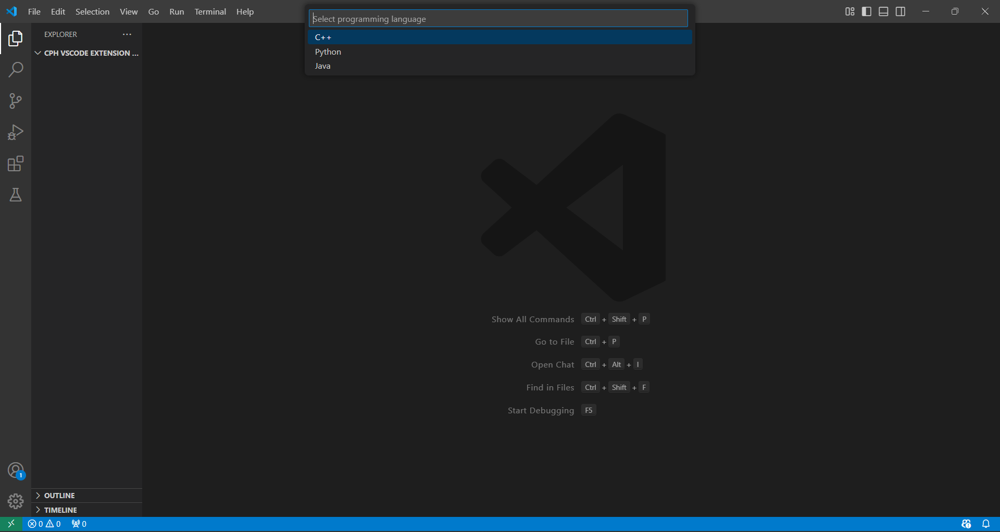

# LeetCode Helper

A VS Code extension that streamlines LeetCode problem-solving by automatically fetching test cases, creating solution templates, and managing test cases - all within your VS Code environment. Test cases are stored in a format compatible with the Competitive Programming Helper (CPH) extension, allowing seamless integration with existing CPH workflows.

## Features

- 🔄 **Automatic Test Case Fetching**: Fetch test cases directly from LeetCode problems using the companion Chrome Extension
- 📝 **Solution Template Generation**: Automatically creates solution files with LeetCode's template code
- 🧪 **CPH-Compatible Test Cases**: Test cases are stored in `.txt` files following the CPH format, enabling compatibility with existing CPH workflows
- ▶️ **Integrated Testing**: Run your solution against all test cases directly within VS Code
- 📊 **Results Visualization**: Clear display of test results showing passed/failed cases
- 🌐 **Multi-Language Support**: Supports C++, Python, and Java

## Installation

### Prerequisites
- Node.js and npm
- Visual Studio Code
- Git

### VS Code Extension Installation
1. First, install the `vsce` package globally:
   ```bash
   npm install -g @vscode/vsce
   ```

2. Clone the repository and build the extension:
   ```bash
   # Clone the repository
   git clone https://github.com/Ameya-Moharir/CPH-VSCode-Extension-Leetcode-Helper-.git

   # Navigate to the project directory
   cd leetcode-helper

   # Install dependencies
   npm install

   # Build the extension
   npm run build
   ```

3. Install the extension in VS Code:
   - Open VS Code
   - Click on the Extensions icon in the left sidebar
   - Click on the three dots (⋯) at the top of the Extensions panel
   - Select "Install from VSIX..."
   - Navigate to the generated `.vsix` file in your project directory
   - Select it and click "Install"

### Chrome Extension Installation
1. Download and extract the Chrome extension files
2. Open Chrome and go to `chrome://extensions/`
3. Enable "Developer mode" in the top right
4. Click "Load unpacked"
5. Navigate to and select the Chrome extension folder
6. The LeetCode Helper extension icon should now appear in your Chrome toolbar (It can be pinned for better accessibility)

### Workspace Setup
1. Open a folder in VS Code where you want to store your LeetCode solutions
2. Ensure you have the required compilers/interpreters installed for your preferred language:
   - C++: G++ compiler
   - Python: Python interpreter
   - Java: JDK

## Usage

### Step 1: Fetching Test Cases
1. Navigate to any LeetCode problem in Chrome
2. Click the LeetCode Helper extension icon
3. Click "Fetch Test Cases"


### Step 2: Creating Solution File
1. In VS Code, you'll get a prompt to select your preferred programming language
2. A new solution file will be created with the LeetCode template
3. The Test Case Manager will open automatically beside your solution



### Step 3: Managing Test Cases
The Test Case Manager allows you to:
- View all test cases
- Add new test cases
- Edit existing test cases
- Delete test cases
- See expected outputs


### Step 4: Running Tests
1. Write your solution in the created file
2. Click "Run Test Cases" in the Test Case Manager
3. View results showing passed/failed cases with detailed input/output information


## Extension Settings

This extension contributes the following settings:

* `cph.language.cpp.compile`: Command to compile C++ code
* `cph.language.cpp.run`: Command to run C++ code
* `cph.language.python.run`: Command to run Python code
* `cph.language.java.compile`: Command to compile Java code
* `cph.language.java.run`: Command to run Java code


## Requirements

- Visual Studio Code v1.60.0 or higher
- Google Chrome for the browser extension
- For C++: G++ compiler
- For Python: Python interpreter
- For Java: Java JDK

---

## Happy coding! Start solving LeetCode problems more efficiently with LeetCode Helper.⭐
